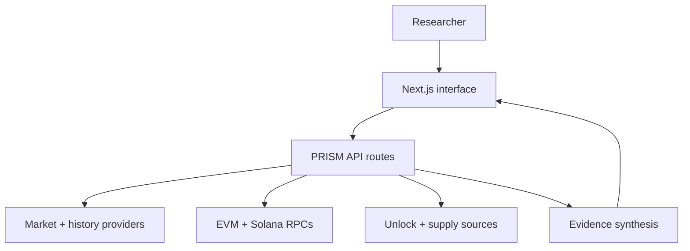

# PRISM

**Evidence-first crypto intelligence for investigating market movement and public on-chain activity.**

PRISM connects live market context, historical pattern replay, token unlock evidence, attributable project accounts, and multi-chain wallet activity in one research workflow.

[Live demo](https://prism-ai-gules.vercel.app) · [Architecture](docs/ARCHITECTURE.md) · [Security notes](SECURITY.md)

## The problem

Crypto research is fragmented across price terminals, block explorers, token-unlock calendars, and wallet tools. That makes it easy to confuse correlation with proof, treat unknown wallets as verified entities, or present historical similarity as a prediction.

## The solution

PRISM starts with a token, symbol, name, contract, or public account and builds a structured investigation:

1. Resolve the asset and load current market evidence.
2. Review its market structure and price history.
3. Compare the current move with similar historical windows.
4. Surface publicly attributable project accounts.
5. Inspect recent EVM or Solana activity.
6. Check scheduled unlock evidence and supply context.
7. Produce a perspective that separates observations from unsupported conclusions.

PRISM is a research tool—not a trading signal.

## Judge walkthrough

1. Open the [live demo](https://prism-ai-gules.vercel.app).
2. Search a token such as `ETH`, `SOL`, or a supported contract address.
3. Select **Run PRISM Scan**.
4. Review the Investigation Report and market evidence.
5. Open **PRISM Replay** to compare historical windows.
6. Inspect an attributed project account or enter a public wallet address.
7. Run **Unlock Intelligence** for dated release and supply context.
8. Save the token or account to the browser-local watchlist.

## Core features

- Token search by name, symbol, CoinGecko ID, or contract address
- Live market data and historical charts
- Market Movers discovery across whole-market and exchange views
- Historical pattern replay with transparent methodology
- Public project-account attribution with confidence labels and sources
- EVM analysis across Ethereum, Arbitrum, Base, Optimism, Polygon, BNB Chain, and Avalanche
- Solana wallet, mint, token-account, program, and transaction classification
- Token unlock investigation with dated schedule and CoinMarketCap supply context
- Evidence synthesis that states what the data can and cannot support
- Browser-local token and account watchlist
- Light and dark themes

## Architecture



The browser coordinates the investigation and stores watchlist items locally. Next.js route handlers validate requests, call public data providers or configured RPCs, normalize the responses, and return only the evidence required by each interface.

See [docs/ARCHITECTURE.md](docs/ARCHITECTURE.md) for the full flow and trust boundaries.

## API surface

| Method | Route | Purpose |
| --- | --- | --- |
| `GET` | `/api/market` | Resolve a token and return normalized market data |
| `GET` | `/api/history` | Return price history for an allowed time range |
| `GET` | `/api/market-movers` | Discover assets with notable 24-hour movement |
| `GET` | `/api/replay` | Compare the current move with historical windows |
| `GET` | `/api/project-wallets` | Return sourced, attributable project accounts |
| `GET` | `/api/wallet` | Inspect recent EVM account activity |
| `GET` | `/api/wallet-priced` | Add market-value context to EVM movements |
| `GET` | `/api/wallet-solana` | Inspect and classify Solana account activity |
| `GET` | `/api/unlocks` | Return verified unlock and supply evidence |
| `POST` | `/api/perspective` | Build a rules-based evidence summary |

## Data sources

PRISM uses public information from providers including CoinGecko, CoinMarketCap public endpoints, NetSupply, DexScreener, public blockchain RPCs, project documentation, and chain explorers. Some routes use transparent fallbacks when the preferred source is unavailable.

Source labels and uncertainty notes are part of the product because data provenance matters in crypto research.

## Tech stack

- Next.js 16, React 19, TypeScript
- Lightweight Charts
- Tailwind CSS
- EVM JSON-RPC and Solana JSON-RPC
- CoinGecko, CoinMarketCap, NetSupply, and DexScreener
- Alchemy-compatible RPC support
- Vercel

## Local setup

### Requirements

- Node.js 20+
- npm
- Optional Alchemy API key for more reliable multi-chain RPC access

### Install

```bash
git clone https://github.com/donatofaith/prism-ai.git
cd prism-ai
npm install
cp .env.example .env.local
npm run dev
```

Open [http://localhost:3000](http://localhost:3000).

### Environment variables

```env
ALCHEMY_API_KEY=
PRISM_SOLANA_RPC_URL=
PRISM_ETHEREUM_RPC_URL=
PRISM_ARBITRUM_RPC_URL=
PRISM_BASE_RPC_URL=
PRISM_OPTIMISM_RPC_URL=
PRISM_POLYGON_RPC_URL=
PRISM_BNB_RPC_URL=
PRISM_AVALANCHE_RPC_URL=
```

All variables are server-only. The application can fall back to public RPCs, but configured endpoints are more reliable.

## Development checks

```bash
npm run lint
npm run build
```

## Interpretation policy

- Historical similarity is descriptive, not predictive.
- Public address activity does not prove ownership, intent, or identity.
- Attribution is shown only when PRISM has a public evidence source.
- A token unlock means assets may become available; it does not prove selling.
- Missing evidence is reported as unknown rather than filled with invented conclusions.
- PRISM does not provide financial advice.

## Prototype boundaries

- The watchlist is stored in the current browser and is not synchronized.
- Provider availability and public-RPC limits can affect results.
- Investigation summaries are deterministic evidence synthesis, not an LLM-generated trading opinion.
- Production deployment should add distributed rate limiting, monitoring, and provider-specific caching.

## Author

Built by **Faith Oluwalana**.

## License

See [COPYRIGHT.md](COPYRIGHT.md).
