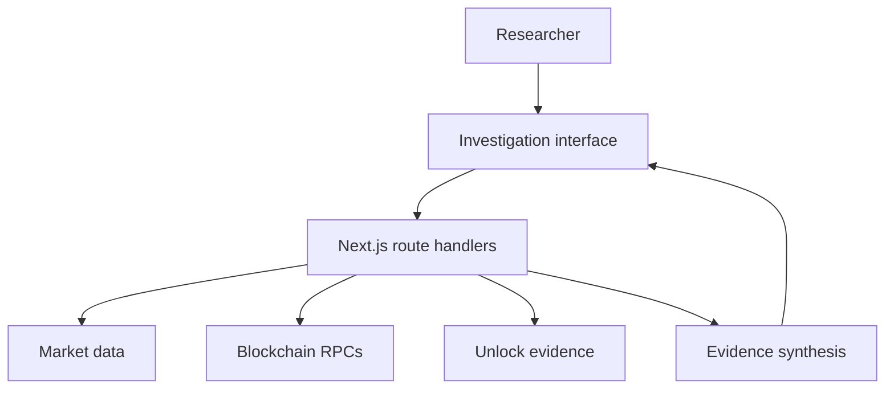

# PRISM architecture

## System overview

## Investigation pipeline

### 1. Asset resolution

`GET /api/market` accepts a token name, symbol, CoinGecko ID, EVM contract, or likely Solana address. Contract searches detect the relevant network where possible. The response contains normalized market fields rather than the provider's complete payload.

### 2. Market and historical evidence

The client requests price history and the replay route. Replay compares the current return window against historical windows, ranks similar outcomes, and reports the observed forward returns. Its methodology and non-predictive interpretation policy are displayed in the interface.

### 3. Attribution

`GET /api/project-wallets` combines a maintained public-evidence registry with dynamically resolved project contracts. Every result includes its chain, account type, source, source URL, explanation, and confidence level. PRISM does not assign real-world ownership to an unknown address.

### 4. Account intelligence

EVM routes use configured or public RPC endpoints to retrieve recent native and token-transfer evidence. The Solana route first classifies the supplied address as a wallet, mint, token account, program, or other account, then interprets recent activity according to that type.

### 5. Unlock intelligence

The unlock route checks dated schedule evidence, adds CoinMarketCap supply context when the same asset can be resolved, and uses current market information to calculate relative scale. It does not convert a supply gap into a fabricated unlock date.

### 6. Perspective

`POST /api/perspective` receives already-normalized market, attribution, and account summaries. It applies deterministic rules to produce evidence items, limitations, and a contextual statement. It does not call an LLM or make a price prediction.

## Trust boundaries

| Boundary | Responsibility |
| --- | --- |
| Browser | User input, rendering, and browser-local watchlist |
| Next.js routes | Validation, provider orchestration, normalization, and controlled errors |
| RPC providers | Public blockchain data and availability |
| Market providers | Token identity, pricing, volume, and history |
| Evidence registry | Sourced labels for known public project accounts |

## Failure behavior

- Invalid addresses, networks, and history ranges return `400`.
- Missing records return controlled `404` responses where appropriate.
- Upstream failures return controlled errors or a documented fallback.
- Unknown attribution stays unknown.
- Provider secrets remain server-side.

## Production hardening

- Add a shared, distributed rate limiter to all external-data routes.
- Apply stricter quotas to RPC-heavy wallet investigations.
- Cache stable identity and token metadata.
- Add request-size limits, timeouts, and structured observability.
- Pin and periodically review all maintained attribution sources.
- Add automated API contract, fallback, and response-redaction tests.
